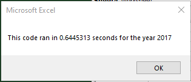
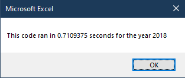
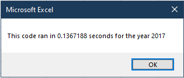
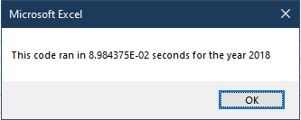

# Stock Analysis

## Project Overview

### Purpose and Background
This project is a refactor of the 'green-stocks' project, which analyzed the volume of shares traded and the yearly return for a select number of environmentally concious companies. The refactor aims to improve the performance of the original analysis script to accomodate the analysis of many more stocks.

## Results

### Performance Metrics
The refactored code redefined the variables that held volume, starting price, and ending price into arrays to eliminate the nested for loop in the old script. The run-times for the old and new scripts are shown below:

### Old
2017: 

2018:

### New
2017: 

2018:

The refactored code executed 5 to 10 times faster than the old code!

## Advantages and Disadvantages of Refactoring Code for Performance

### Advantages
* Improved performance

### Disadvantages
* May lead to more complex and less readable code for the sake of performance
* May be harder to add functionality in the future (less flexible)

### Application to this project
This project definitely gave the code a huge performance boost, but it is a little bit harder to read. The arrays had to be initialized with hard coded 'magic' values, which will all need to be changed if more stocks are added. VBA does not allow array sizing definitions to be a variable, so I could not dynamically determine the amount of tickers in the raw data. Overall, I would recommend using another programming language for stock analysis.
